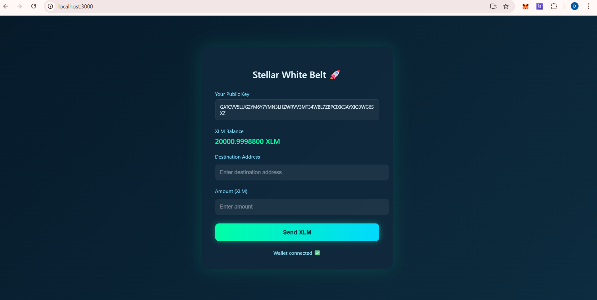
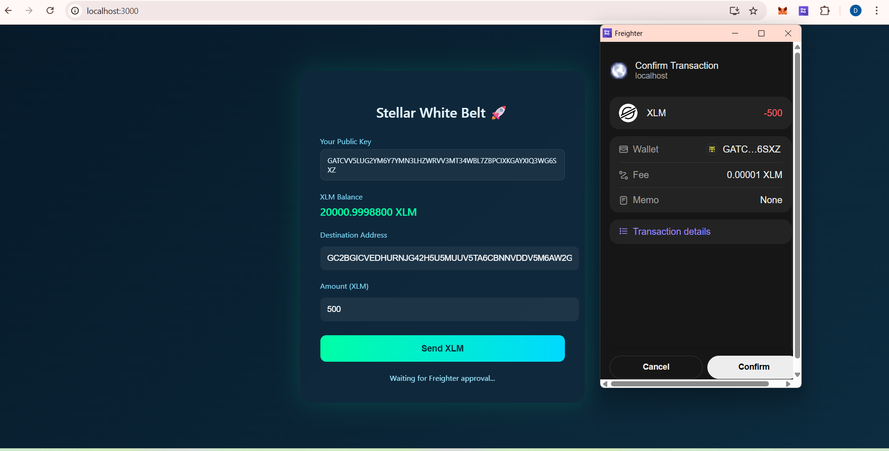
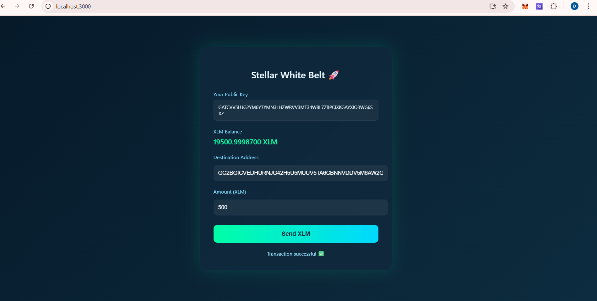

# Stellar White Belt 🚀

## Project Description
This project is a simple Stellar decentralized application (dApp) built using React.  
It connects to the Freighter wallet, displays the user public key and XLM balance, and allows sending XLM transactions on the Stellar Testnet.

The wallet connection requires user approval through the Freighter popup, and every transaction must be confirmed by the user.

---

## Features
- Connect Freighter Wallet  
- Display Public Key  
- Show XLM Balance  
- Send XLM to another account  
- Transaction confirmation popup  
- Transaction success status  

---

## Setup Instructions (Run Locally)

1. Install dependencies

npm install

2. Start the project

npm start

3. Open in browser  
http://localhost:3000  

---
## Screenshots

### Wallet Connection Request

### Wallet Connected & Balance

### Transaction Confirmation

### Transaction Successful

---

## Tech Stack
- React  
- Stellar SDK  
- Freighter Wallet  
- Stellar Testnet  
